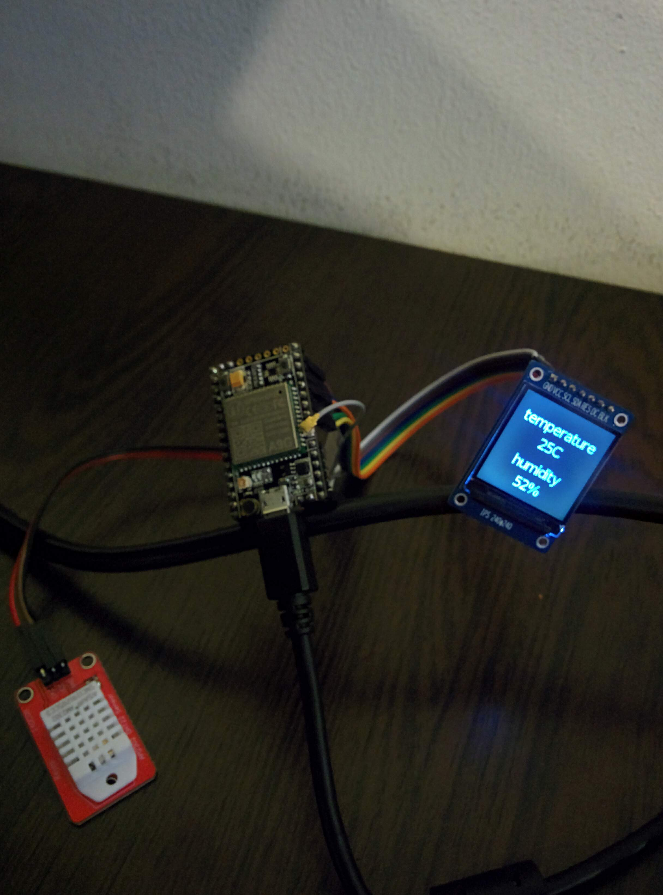

# Gsm-temperature-monitor

- This is simple temperature and humidity monitor,implemented on a9g development board , with DHT22 sensor and ST7789 display.
- It sends sms info about temperture and humidity in every 3 hour to you phone number.
- Also it can show data on display,when you press power button.(screen off after 10 second , since button press)
- It needs very low power,because of sleep mode

